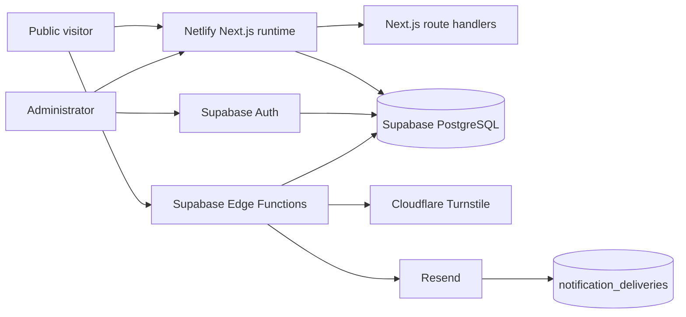
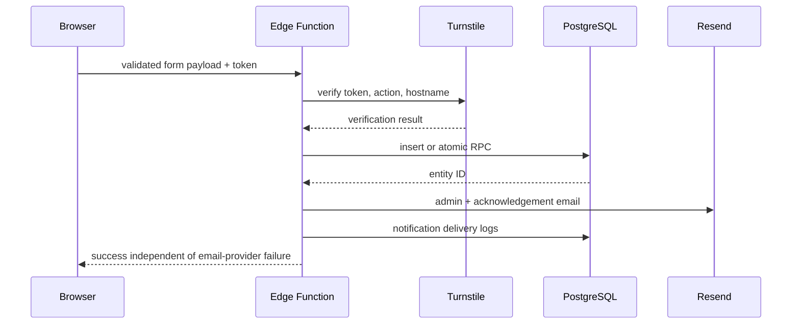

# Developer Handoff

This is the canonical technical reference for the current Oriens Academy implementation. Older phase and audit documents remain useful historical evidence, but this file and the root README take precedence where architecture has changed.

## System Boundaries



Netlify serves the App Router application and request-time API routes. Supabase owns persistent data, administrator identity, authorization policies, atomic booking RPCs and public submission functions. The browser may be running on localhost while Edge Functions and data are hosted remotely; confirm the environment variables before running mutation tests.

## Frontend and Route Model

`src/app/layout.tsx` loads Inter, Manrope and DM Serif Display and wraps the application in the one-time compass loader. `src/app/[lang]/layout.tsx` validates `tr`/`en`, mounts localized context, public navigation, transitions, contact surfaces, JSON-LD, GA4 and GTM. Admin routes have a separate layout and do not mount public analytics.

Public localized route pairs are defined in `src/lib/routes.ts`: home, exams, university support, pricing, about, booking, contact, assessment, privacy and terms. Exam details use the stable lowercase exam slug under the localized exam hub. `generateStaticParams` pre-renders known locale/content combinations, but the deployment is **not** a static export because runtime route handlers remain active.

Runtime APIs:

| Route | Method | Purpose | Boundary |
|---|---|---|---|
| `/api/search/autocomplete` | GET | Database-backed grouped search and intent result | Query capped at 120 characters; returns 503 on backend failure |
| `/api/eligibility/evaluate` | POST | Evaluate a profile against a valid active program | Uses server service role when configured; quarantined records return data unavailable |
| `/api/admin/source-registry` | GET | Read source-registry records | Current database policies expose registry rows; do not treat the route name alone as authorization |

## Content, Exams and Relationships

Locale dictionaries are in `src/content/tr` and `src/content/en`. Shared exam structure is in `src/content/exams.ts` and the definitive code tuple is in `src/content/shared.ts`: IB, AP, SAT, ESAT, TARA, TMUA, IGCSE, GRE, GMAT, UKCAT, IMAT and OMPT. Detail copy is in the locale-specific `exam-details.ts` files.

University/destination relationships are maintained in `src/data/exam-university-map.ts`; study regions are derived in `src/data/study-destinations.ts`. Admission/search data has a second, database-backed architecture under `src/lib/admission*`, `program-ingestion`, `requirement-extraction`, `qualification-normalization`, `search` and related migrations. Preserve source URLs and verification dates when updating relationship data.

## Public Component Map

| Area | Primary implementation |
|---|---|
| Navigation and locale switch | `src/components/sections/Navbar.tsx`, `LanguageSwitch.tsx`, `LanguageTransitionProvider.tsx` |
| Homepage and hero | `src/app/[lang]/page.tsx`, `src/components/sections/Hero.tsx`, `HeroVisual.tsx` |
| Phone carousel | `src/components/ui/phone-mockups-1.tsx`, `phone-mockups-1-utils/phone-carousel.tsx` |
| Exam hub/detail/carousel | `src/components/exams/*`, `src/components/ui/three-d-exam-carousel.tsx` |
| Search/eligibility | `src/components/discovery/GlobalSearchEngineView.tsx`, `EligibilityDrawer.tsx` |
| Destination globe | `src/components/discovery/StudyDestinationGlobe.tsx`, `StudyDestinationSection.tsx` |
| Pricing | `src/components/pricing/PricingPage.tsx`, `src/components/ui/oriens-creative-pricing.tsx` |
| Testimonials | `src/components/sections/ResultsTestimonials.tsx`, `src/components/testimonials-section.tsx` |
| Journey/method | `src/components/sections/StudentJourney.tsx`, `src/components/how-it-works.tsx` |
| Contact/consultation | `src/components/contact/*`, `src/components/sections/BookingCTA.tsx` |
| Booking | `src/components/booking/BookingFlow.tsx`, `BookingStepper.tsx` |
| Footer/contact rail | `src/components/sections/Footer.tsx`, `src/components/ui/social-links.tsx` |
| Page/loader motion | `src/components/motion/*`, `src/components/brand/*` |

Externally sourced component restoration information is indexed in `docs/COMPONENT_REFERENCES.md`.

## Admin Architecture

Routes are `/admin`, `/admin/login`, `/admin/forgot-password`, `/admin/reset-password`, `/admin/change-password`, `/admin/randevular`, `/admin/ogrenciler`, `/admin/iletisim`, `/admin/musaitlik`, `/admin/fiyatlandirma`, `/admin/icerik`, `/admin/bildirimler`, `/admin/denetim` and `/admin/ayarlar`.

`AdminAuthProvider` is mounted once in `src/app/admin/AdminClientLayout.tsx`. `AdminGuard` gates the shell. Authorization requires all of:

1. a valid Supabase Auth session;
2. immutable JWT `app_metadata.role === "admin"`;
3. an `admin_profiles` row with `role = admin` and `active = true`;
4. the relevant RLS policy/grant.

Supabase token refresh and repeated `SIGNED_IN` events revalidate silently. Do not reset the global status to loading on tab focus, key the provider by pathname, or use `window.location` for internal admin navigation: doing so unmounts forms and drawers. Next.js `Link`/router navigation preserves the shell. The availability modal additionally stores a non-sensitive transient draft in `sessionStorage`; successful save and explicit cancel clear it. Never extend draft storage to passwords, tokens, secrets or unnecessary PII.

Admin modules call helpers under `src/lib/admin`. Appointments include atomic/manual booking status workflows; students aggregate contact and booking history; contact detail surfaces structured package metadata; pricing and testimonials manage public records; settings update notification/configuration rows; notification and audit pages are read-oriented operational logs.

Administrator credentials must be transferred separately through a secure channel.

## Database Entities

Migrations are the schema source of truth. Important entity families are:

| Entity | Purpose / visibility / write path |
|---|---|
| `admin_profiles` | Active admin profile; authenticated admin read, privileged setup/write |
| `pricing_packages` | Public active pricing; admin CRUD; package context is snapshotted into contact metadata |
| `availability_slots` | Future availability; reduced public read through Edge Function; admin management |
| `bookings` | Booking PII/status; Edge Function/RPC or admin RPC writes; admin-only reads |
| `contact_requests` | Lead PII/status and JSON metadata; Edge Function writes; admin-only reads |
| `site_settings` | JSON configuration; only explicitly public rows may be read anonymously |
| `testimonials` | Public active/verified testimonials; admin CRUD |
| `audit_logs` | Administrative/system action history; admin read, controlled inserts |
| `notification_deliveries` | Resend delivery attempts and failures; admin read, server insert/update |
| `admin_password_reset_limits` | Server-only hashed cooldown state; no direct client access |
| `countries`, `universities`, `programs`, `qualifications` | Admission/search catalogue with active public-read policies |
| `admission_sources`, `admission_source_snapshots` | Provenance and captured source evidence |
| `admission_requirement_groups`, `admission_requirements` | Structured entry rules |
| `search_aliases` | Normalized search aliases and authority ranking |
| `fields_of_study`, `program_external_identifiers` | Program classification/identity |
| `university_domains`, `university_source_registry` | Official-domain and discovery registry |
| `ingestion_runs`, `program_quality_audits` | Ingestion trace and quality quarantine |

Relations include booking-to-slot, admin-profile-to-auth-user, program-to-university/field, requirement-to-program/group/source and delivery log-to-parent entity by typed identifier. Inspect the latest migrations before changing permissions; later grants and policies supersede the initial schema.

## RLS and Privilege Model

`public.is_admin()` evaluates the JWT app metadata role. RLS is enabled across managed tables. Public browser reads are limited to approved content/search records and filtered availability; anonymous clients have no direct PII mutation path. Administrator browser access uses the authenticated role plus admin policies. Edge Functions use service-role credentials only on the server and receive least-privilege table/function grants. `reserve_booking_slot` and admin booking RPCs are `SECURITY DEFINER`/explicitly granted as defined by migrations.

Do not infer safety from a publishable key: RLS is the authorization boundary. Do not move service-role access into browser code.

## Edge Functions and Workflows

| Function | Method/auth | Processing |
|---|---|---|
| `booking-availability` | GET, public | Origin/CORS handling; returns future available slot DTOs only |
| `create-booking` | POST, public gateway | Validates input/consent and `booking_submit` Turnstile action; calls atomic reservation RPC; dispatches two emails |
| `create-contact` | POST, public gateway | Validates contact/consultation/quick-contact payload and matching Turnstile action; validates package ID against active pricing; stores structured metadata; dispatches emails |
| `admin-password-reset` | POST, public gateway | Strict configured-email match, Turnstile action, hashed DB cooldown, admin identity/profile verification, password rotation and email delivery |



Booking locks the selected slot, checks future/available status, marks it booked, inserts a pending booking and writes audit data within the database transaction. A partial unique index provides a second double-booking defense.

Contact sources are `contact_form`, `consultation` and `quick_contact`. Consultation package query values are allowlisted; display name, price, currency and lesson count are re-read server-side and stored as metadata. Student acknowledgement emails never expose package metadata; admin email/detail views do.

## Email, Turnstile and Failure Semantics

Shared templates and dispatch live under `supabase/functions/_shared/email`. Resend uses `RESEND_API_KEY` and `RESEND_FROM_EMAIL`; recipient/locale settings come from private `site_settings`. Templates provide TR/EN text plus table-based email-safe HTML and omit absent fields. Each message receives an entity-derived idempotency key.

Provider failures are recorded as failed `notification_deliveries` and do not roll back a successfully stored booking/contact. Investigate and resend deliberately; avoid creating a duplicate request.

Turnstile configuration is split between the public site key and the Edge Function secret. The verifier checks token, hostname and action. Local development may use Cloudflare's official test keys only when the function environment is explicitly marked development. Production fails closed without a secret.

## Globe and Data Flow

`StudyDestinationGlobe.tsx` uses D3 geo modules and a Canvas 2D orthographic projection; **cobe is not installed or used**. Country geometry is local at `public/data/world-countries-110m.geojson`. Regions are UK, Europe, US, Canada and other destinations. The globe derives exam links from `study-destinations.ts` and `exam-university-map.ts`.

Rendering caps DPR at 1.25 on mobile and 1.5 elsewhere, skips far-side features, pauses when offscreen/hidden, and reports diagnostic FPS data attributes. Auto-rotation is roughly `0.0038` degrees per millisecond; pointer hover/drag pauses it, release resumes after two seconds, and region camera movement takes 900ms. Reduced motion disables continuous rotation and makes region camera moves immediate.

## Analytics and SEO

The localized public layout mounts both GA4 and GTM. Consent Mode v2 defaults analytics/ad storage to denied; consent is stored under `oriens_consent_v1`. Success-event helpers transmit locale and exam/category labels only, not direct PII. Admin pages do not mount analytics. Keep GA/GTM ownership and duplicate-tag checks in the handoff checklist.

Metadata is generated per locale/page/exam with canonical and hreflang alternates. `src/app/sitemap.ts`, `robots.ts` and `JsonLd.tsx` provide sitemap, admin exclusion and structured data. `metadataBase` is `https://oriens-academy.com`.

## Animation Architecture

Motion for React powers loader, hero, reveals, route transitions, counters and component interactions. DotLottie uses the shared `OriensLottie` wrapper. CSS handles simple hover/focus and the Wave bars. Continuous components use observers and document visibility to avoid offscreen work. Global CSS reduces animation/transition durations under `prefers-reduced-motion`; major Motion components also branch explicitly. Full maintenance details are in `docs/DESIGN_SYSTEM.md`.

## Deployment and Environments

Netlify uses `npm run build`, Node `20.18.0`, the Next.js runtime, a root-to-TR redirect and security/cache headers. There is no static-export output setting. Supabase is deployed independently; its migrations and Edge Functions are not deployed by the Netlify build. Resend, Turnstile and analytics are external services.

Local frontend, local Supabase and hosted Supabase are distinct. Verify `NEXT_PUBLIC_SUPABASE_URL` before running any script. Scripts that mutate data contain local-host safety checks where appropriate; ingestion scripts may intentionally target a configured project and require explicit service credentials.

## Developer Workflows

```bash
npm install
npm run dev
npm run lint
npm run build
npm audit --omit=dev
npm run local:supabase:start
npm run local:reset
npm run test:search:api
npm run test:search:browser
```

There is no configured Jest, Vitest, Playwright or Cypress runner. The repository contains maintained Node/TypeScript/CDP diagnostic scripts under `scripts/`; read each script's environment and mutation behavior before use. Browser scripts write ignored evidence to `test-results/`.

## Content and Operational Ownership

- Homepage/navigation/footer/contact copy: `src/content/{tr,en}` and `src/config/contact.ts`.
- Exam structure/detail: `src/content/exams.ts`, `shared.ts`, locale exam files.
- About/university pages: locale content modules.
- Destination/university relationships: `src/data/study-destinations.ts`, `exam-university-map.ts`.
- Pricing/testimonials: primarily admin-managed Supabase records, with content adapters/fallbacks in `src/content`.
- Transactional templates: shared Edge Function email files.
- Schema/policies: migrations only.

See `docs/MAINTENANCE.md` for recurring checks.

## Security and Transfer Checklist

Never commit real environment files, admin passwords, service-role keys, database credentials, private keys, Resend keys or Turnstile secrets. Transfer administrator credentials and organization/project access for Supabase, Netlify, registrar/DNS, Resend, Cloudflare, GA/GTM and Search Console through a secure channel outside the repository. Confirm least privilege and remove departing users after handoff.
